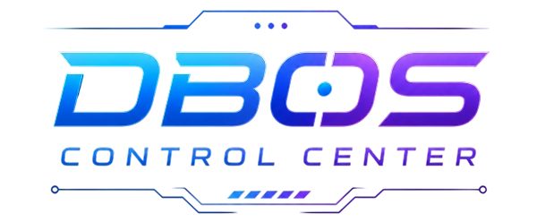

  

  
# DBOS Control Center
**D**odo **B**ot **OS** Control Center is a Visual Studio Code extension for managing Dodo Bot OS devices over SSH.

# How does it work?
Install the DBOS Control Center extension in Visual Studio Code.
Connect to your Dodo Bot OS device over SSH.
Once connected, the extension securely communicates with the device and provides access to management tools.

# Features
- :page_facing_up: View Dodo Bot logs
- :open_file_folder: Open and manage Dodo Bot files
- :arrow_forward: Start Dodo Bot
- :stop_button: Stop Dodo Bot
- :arrows_counterclockwise: Restart Dodo Bot
- :electric_plug: Reboot the hardware device

More management features will be added in future releases.

## Screenshots

  
   
  

